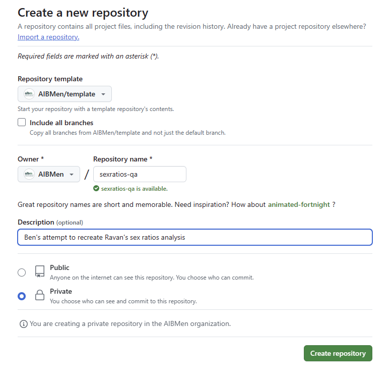

# Project Template README

This is a README file describing (1) how to download, install, and set up git and GitHub Desktop, (2) how to integrate and use it from within RStudio, (3) how to use GitHub for collaboration and version control, and (4) guidelines for organizing your analysis projects and writing code so that others can more easily understand it and do quality control checks.

Numbers (3) and (4) are a work in progress and mostly just suggestions at this point. Don't feel like you need to do everything in exactly the way I've described if it doesn't make sense or seems overly burdensome. The goal should be to have just enough structure and standardized processes to make collaboration easier without overengineering things.

I'm using RStudio and R because that's what I'm most familiar with at the moment and it's what others have been using. Python is an alternative, and I'm sure it works well, I just am less familiar with it.

## 1. git and GitHub Desktop

* In general, www.happygitwithr.com is a great resource to walk you through installation and using git within RStudio.
* Specifically, [Chapter 4](https://happygitwithr.com/github-acct) will walk you through registering a GitHub account.
* After you create an account, ask Alanna or Ben to add you to the AIBM organization account on GitHub
* Then go back to [Chapters 5-9](https://happygitwithr.com/install-r-rstudio) for instructions on installing R and RStudio, installing git, and installing a git client like GitHub Desktop (it doesn't really matter which client you use, GitHub Desktop is just the one I picked becaused it seemed simple.)

## 2. Using git and RStudio

* [Chapters 9, 11, 12](https://happygitwithr.com/https-pat) walk you through creating an access token on GitHub (this is what you use instead of your GitHub account password to access the remote server on GitHub. I created a token for HTTPS because this seemed simpler.) and using git through RStudio. For me, this just worked. I installed git, RStudio recognized it automatically, and when I selected File > New Project, the option to create a new version-controlled project from a repository showed up. [Chapters 13 and 14](https://happygitwithr.com/rstudio-see-git) have some guidance and troubleshooting steps if this doesn't happen.


*You should see something like this when you start a new project in RStudio*

* Some parts of the walkthrough describe R commands and functions you can use to do various GitHub things like create tokens. For example:

```
usethis::create_github_token()
```

However, I found this kind of confusing, and it's not really explained in the walkthrough (do I need to install these packages? When? Are they installed automatically?) Mostly I ignored this. Maybe these will be necessary at some point, but we'll see. 

* Now you should be able to start using GitHub to manage analysis projects you're working on in RStudio.

* [Chapter 15](https://happygitwithr.com/new-github-first) describes what I thought was the most straightforward way of doing this. Create a repository on GitHub first, then clone it to your machine using the RStudio IDE (see section 15.2.2)

## 3. Using GitHub for collaboration and version control

* Once the new repository is cloned on your local machine through git and RStudio, you're ready to get to work. The general process looks like, clone, edit, stage, commit, and push. Git has other features like forking and branching that I am not as familiar but that we can figure out as we need them.

### When to commit

* From [Pew](https://www.pewresearch.org/decoded/2022/08/01/how-pew-research-center-uses-git-and-github-for-version-control/)'s article on using GitHub for data analysis.

> However, the more difficult question is not how to write a commit message but when to create one. What is the appropriate level of granularity in analysis code?
Sometimes what goes into a separate commit is obvious. For instance, maybe there is a problem caused by a call to a function that uses the wrong name. But more generally, when one is writing a script for data analysis, what is the best way to think about a discrete set of changes?

> In our case, we approached the problem by thinking of a commit as an item on a to-do list. We can often clearly picture what we need to do when we need to, say, analyze a small survey. First, we need to read in and clean the data. Then we make descriptives of the variables we are interested in. Finally, we need to make production-quality tables and figures of the results we want to show. Each of these steps can be thought of as an item on a list of tasks that leads to a complete set of results, and each of them is a good candidate for a separate commit. The metaphor is admittedly ambiguous but, if nothing else, it gives team members an intuition about practices that are better avoided — such as thinking of commits as daily savepoints — and primes them to decompose their plans for a given analysis into roughly similar chunks.


### When to branch

* Also from [Pew](https://www.pewresearch.org/decoded/2022/08/01/how-pew-research-center-uses-git-and-github-for-version-control/)'s article on using GitHub for data analysis.
* I think for now we probably won't do much of this, because we won't have multiple people working on a single analysis. But this is something we can start thinking about.

> Another git concept we needed to adapt was branching. As we said, in software engineering, branches are used to add improvements to an application in production that often lives in the “main” branch. In research, the code is never really in “production” until the corresponding report or blog post has been published. In the process of building an analysis, researchers try different things, some of which will work and some of which will not. But those are not features or bugs. We thought it made more sense to think of the main branch as containing a version of analysis on which all researchers agree, and to think of branches starting from “main” as individual researchers’ proposed additions. In a very literal way, we think of merging code into the main branch as a discussion between co-authors. Thus, if a commit is an item on a to-do list, a branch is a section of a to-do list that accomplishes a specific goal — something like “explore a method of analysis to address a particular question in our research” or “respond to feedback about the project.” These are blocks on which researchers can work separately and which can be understood as proposed additions to a collective analysis.

> The key idea is that branches define natural points for the people working on a project to get together and discuss whether the analysis is moving in the right direction. Consequently, merging a branch into “main” is a key step in our quality control process. We take advantage of the way GitHub structures collaboration. To merge a branch, the researcher opens a pull request, which is an interface for requesting a review on the branch’s changes before putting them into a place that contains the results we all agree on. This step enforces the idea of code in the “main” branch being a consensus among researchers.
> The type of consensus that is required changes over the life of a project. Some pull requests only need to be scrolled through and checked for appropriate file structure and documentation. Others need more robust checks. For example, a script that starts a time-intensive data collection is something you want to get right the first time. Our approach to branches and pull requests accounts for this variation by outlining what information needs to be communicated when opening a pull request, as opposed to using specific standards for review.

> This process also ensures that no research decision can be made by a single person and that all the code is viewed by at least two people. One person developing alone will inevitably make mistakes that two or more people developing in tandem will catch. Two people discussing research decisions together, as they are implemented, also results in better designs. Early and consistent review also helps us write better, cleaner and more legible code, which, in turn, makes it much easier for someone in the future to re-run the code and replicate the analysis.

> Incorporating branches and pull requests into our workflow changed the pace and style of all our work. The branch-pull request-review process slows things down, but we think sacrificing some time to ensure quality is worth it. This process encodes a method of collaborative decision-making between all the researchers in the team. It becomes less of a review to ensure the code is flawless and more of a quick check to prevent headaches at the end of the project. In general, it provides an opportunity to take a moment to check in with collaborators: to discuss a new idea for approaching an analysis, confirm that a method is working or just make sure everyone is up to date on the current status of the project.

### When to Pull

* A pull request is "a proposal to merge a set of changes from one branch into another. In a pull request, collaborators can review and discuss the proposed set of changes before they integrate the changes into the main codebase. Pull requests display the differences, or diffs, between the content in the source branch and the content in the target branch."
* More info [here](https://docs.github.com/en/pull-requests/collaborating-with-pull-requests/proposing-changes-to-your-work-with-pull-requests/about-pull-requests)

### When to use Issues

* There is an Issues feature for each repository in GitHub. You can use these to track problems, questions, to-do lists, etc. associated with the project. You can label issues, include to-do lists, assign an issue to a particular person, etc.  
* See this [quickstart guide](https://docs.github.com/en/issues/tracking-your-work-with-issues/quickstart) for more detailed explanations.
* See [here](https://docs.github.com/en/issues/tracking-your-work-with-issues/creating-an-issue) for GitHub instructions

## 4. Organizing your analysis

* I have created what's called a "template" repository. This is a type of repository you can designate in GitHub that you can then duplicate and use as a skeleton for future projects. You cand do this by going into the template repository on GitHub and clicking the green "Use this template" button on the upper right-hand side.




* I would recommend using this file structure for all your projects. It has the following folders:
  * code: for source code files.
  * data: this should have all the original and cleaned/processed data. It has two subfolders, "raw" for the original dataset. These should stay unmodified. GitHub has a filesize limit of 50 MB so if the dataset is larger than that, it probably shouldn't be part of the repository. Instead, just include a comment in the source code that has a link for where someone can download the data you've used. For instance, in the sex ratios project, some of the census data tables are over 150 MB. Instead of including these in the repository, just provide a link in the source code or in the README file for the project so someone else can easily find it. On your local machine, you can still have the .csv file in your data/raw folder, just make sure not to "commit" it to the repository. THere are probably some better/more sophisticated ways to handle this like using [.gitignore](https://docs.github.com/en/get-started/getting-started-with-git/ignoring-files) or using [Git Large File Storage (git-lfs)](https://docs.github.com/en/repositories/working-with-files/managing-large-files/about-git-large-file-storage) but I'm not sure how to do this and if it makes things more complicated than necessary. 
  * docs: any documentation like codebooks, technical guides, etc. 
  * notebooks: if you use R Markdown or something like that, those can go in here.
  * results: plots, images, .csv files with analyzed data that can be input into datawrapper, etc. should go in here.


### README files.

There's also a README.md file. The README.md file serves as your project’s front door. It should encompass an overview of your project’s objectives, data sources, required packages or installation tips, analysis reproduction steps, and results.

Update README Regularly. Maintain an updated README to reflect your project’s current state, enabling clear comprehension for others.

### Code Comments

* https://www.gov.uk/government/publications/the-aqua-book-guidance-on-producing-quality-analysis-for-government
* https://best-practice-and-impact.github.io/qa-of-code-guidance/principles.html

> In a reproducible workflow, you must bring together the code and the data that you used to generate your results. These are ideally published alongside your reports, with a record of analytical choices made and the responsible owners of those choices.

> ...

> Comments can be used more effectively to explain why you might have written code in a certain way. For example, you might explain to other analysts and developers why a section of your code doesn’t follow standard practices, perhaps because the typical method didn’t work. This type of comment can help to clarify your decision-making process, without needing to describe the individual steps taken.
> In short, comments explaining why you made programming choices will help your future self and other developers to understand your intentions.

### Quality Assurance Checklist

* Quality assurance checklist from [the quality assurance of code for analysis and research guidance](https://best-practice-and-impact.github.io/qa-of-code-guidance/intro.html).
* This is more detailed than we need. I've cut a few things, but there's still a number of items that probably won't get used or need more thought before trying to do. Think of this as a general template you can copy into the readme for your project and pare down as needed. 
* https://best-practice-and-impact.github.io/qa-of-code-guidance/checklists.html

#### Modular code

- [ ] Individual pieces of logic are written as functions. Classes are used if more appropriate.
- [ ] Repetition in the code is minimalised. For example, by moving reusable code into functions or classes.

#### Good coding practices

- [ ] Names used in the code are informative and concise.
- [ ] Code logic is clear and avoids unnecessary complexity.
- [ ] Code follows a standard style, e.g. [tidyverse](https://style.tidyverse.org/) for R.

#### Project structure

- [ ] A clear, standard directory structure is used to separate input data, outputs, code and documentation.

#### Code documentation

- [ ] Comments are used to describe why code is written in a particular way, rather than describing what the code is doing.
- [ ] Comments are kept up to date, so they do not confuse the reader.
- [ ] Code is not commented out to adjust which lines of code run.
- [ ] All functions and classes are documented to describe what they do, what inputs they take and what they return.
- [ ] Python code is [documented using docstrings](https://www.python.org/dev/peps/pep-0257/). R code is [documented using `roxygen2` comments](https://cran.r-project.org/web/packages/roxygen2/vignettes/roxygen2.html). (Not sure what these are and have never used them.)

#### Project documentation

- [ ] A README file details the purpose of the project, basic installation instructions, and examples of usage.
- [ ] The extent of analytical quality assurance conducted on the project is clearly documented.
- [ ] Assumptions in the analysis and their quality are documented next to the code that implements them. These are also made available to users.
- [ ] Copyright and licenses are specified for both documentation and code.
- [ ] Instructions for how to cite the project are given.

#### Version control

- [ ] Code is [version controlled using Git](https://git-scm.com/).
- [ ] Code is committed regularly, preferably when a discrete unit of work has been completed.
- [ ] An appropriate branching strategy is defined and used throughout development.

#### Configuration

- [ ] Credentials and other secrets are not written in code but are configured as environment variables.
- [ ] Configuration is clearly separated from code used for analysis, so that it is simple to identify and update.
- [ ] The configuration used to generate particular outputs, releases and publications is recorded.

#### Data management

- [ ] All data for analysis are stored in an open format, so that specific software is not required to access them.
- [ ] Input data are stored safely and are treated as read-only.
- [ ] Input data are versioned. All changes to the data result in new versions being created, or [changes are recorded as new records](https://en.wikipedia.org/wiki/Slowly_changing_dimension).
- [ ] All input data is documented in a data register, including where they come from and their importance to the analysis.
- [ ] Outputs from your analysis are disposable and are regularly deleted and regenerated while analysis develops. Your analysis code is able to reproduce them at any time.

#### Peer review

- [ ] Peer review is conducted and recorded near to the code. Merge or pull requests are used to document review, when relevant.

#### Testing

- [ ] Core functionality is unit tested as code. See [`pytest` for Python](https://docs.pytest.org/en/stable/) and [`testthat` for R](https://testthat.r-lib.org/). 
- [ ] Code based tests are run regularly, ideally being automated using continuous integration.
- [ ] Bug fixes include implementing new unit tests to ensure that the same bug does not reoccur.
- [ ] Informal tests are recorded near to the code.
- [ ] Stakeholder or user acceptance sign-offs are recorded near to the code.

#### Dependency management

- [ ] Required passwords, secrets and tokens are documented, but are stored outside of version control.
- [ ] Required libraries and packages are documented, including their versions.
- [ ] Working operating system environments are documented.
- [ ] Example configuration files are provided.

#### Logging

- [ ] Misuse or failure in the code produces informative error messages.
- [ ] Code configuration is recorded when the code is run.

#### Project management

- [ ] The roles and responsibilities of team members are clearly defined.
- [ ] An issue tracker (e.g GitHub Project, Trello or Jira) is used to record development tasks.
- [ ] New issues or tasks are guided by users’ needs and stories.
- [ ] Acceptance criteria are noted for issues and tasks. Fulfilment of acceptance criteria is recorded.

